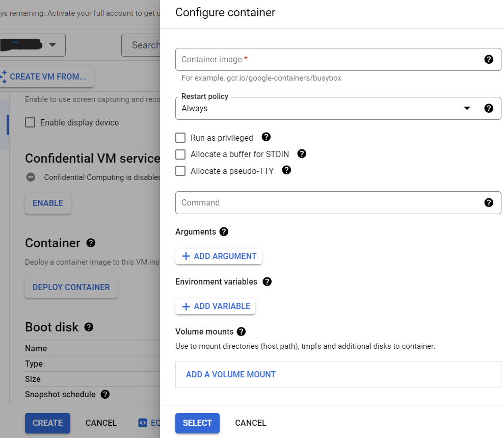
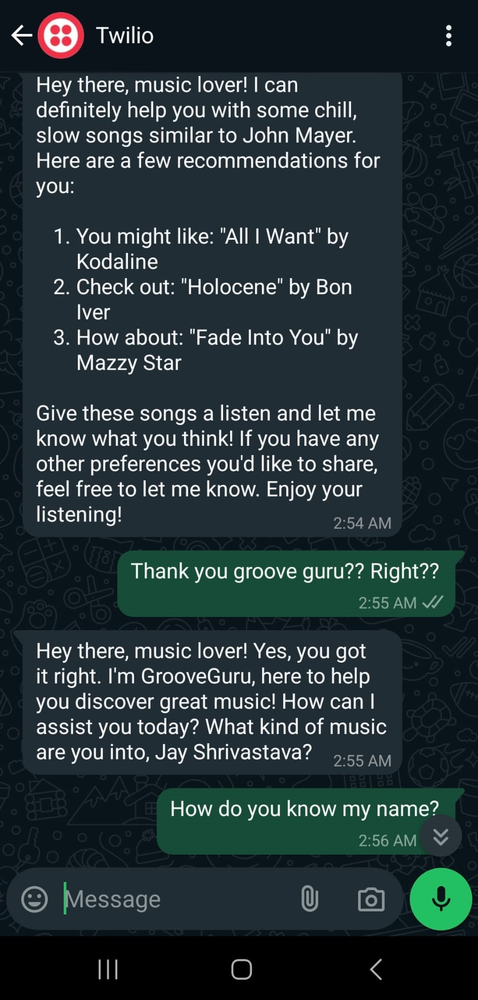

# Groove Guru

<div align="center">
  
</div>

## Your Personalized Music Recommendation Assistant on WhatsApp


Welcome to **GrooveGuru**—an AI-powered music recommendation assistant that integrates OpenAI's GPT models with Twilio's WhatsApp API. This readme walks you through setting up GrooveGuru, understanding its code structure, and deploying it on Google Cloud Platform (GCP) using Docker. 

By following the steps outlined in this README, you'll set up your own smart assistant capable of interacting with users on WhatsApp and providing personalized music recommendations based on their preferences.

## Table of Contents

- [Groove Guru](#groove-guru)
  - [Your Personalized Music Recommendation Assistant on WhatsApp](#your-personalized-music-recommendation-assistant-on-whatsapp)
  - [Table of Contents](#table-of-contents)
  - [Introduction](#introduction)
      - [**System Design**](#system-design)
  - [Setting Up Your Environment](#setting-up-your-environment)
    - [Twilio Setup](#twilio-setup)
    - [OpenAI Setup](#openai-setup)
    - [Environment Variables](#environment-variables)
  - [Understanding the Code](#understanding-the-code)
    - [Classes and Functions](#classes-and-functions)
      - [`MyHTTPRequestHandler` Class](#myhttprequesthandler-class)
      - [`process_user_message` Function](#process_user_message-function)
  - [Deployment Guide](#deployment-guide)
    - [Docker Setup](#docker-setup)
    - [Deploying on GCP](#deploying-on-gcp)
  - [Example Usage](#example-usage)
    - [Did you noticed GrooveGuru knew my name?](#did-you-noticed-grooveguru-knew-my-name)
  - [Acknowledgements](#acknowledgements)

## Introduction

**GrooveGuru** is a project designed to blend conversational AI with music recommendations, creating an engaging experience for users on WhatsApp. The assistant leverages OpenAI's powerful language models to process user inputs and generate music recommendations. 


The system is designed to handle user inputs through the WhatsApp API, sending these inputs to the host server, which then interacts with the OpenAI Assistant API to generate appropriate music recommendations. The response is then sent back through the WhatsApp API to the user. Below is a visual representation of this system design:

#### **System Design**


## Setting Up Your Environment

Before diving into the code, you'll need to set up a few things. Let's break it down step by step.

### Twilio Setup

1. **Create a Twilio Account**: Start by signing up for a Twilio account [here](https://www.twilio.com/). Twilio offers a WhatsApp Sandbox, perfect for testing.
    <div align="center">
    
    </div>
2. **Obtain Your Account SID and Auth Token**: These credentials are essential for integrating Twilio with your project. Find them on your Twilio Console dashboard.
    <div align="center">
    
    </div>

3. **Set Up the WhatsApp Sandbox**: Twilio's WhatsApp Sandbox allows you to test sending and receiving messages. Follow the setup guide provided by Twilio [here](https://www.twilio.com/docs/whatsapp/sandbox).
    <div align="center">
    
    </div>

4. **Twilio WhatsApp Number**: You'll use the Twilio-provided number to send and receive WhatsApp messages. This number is universal for twilio `+1 415 523 8886`
    <div align="center">
    
    </div>

### OpenAI Setup

1. **Sign Up for OpenAI**: Create an account on OpenAI if you haven't already. You can sign up [here](https://beta.openai.com/signup/).
    <div align="center">
    
    </div>
2. **Generate an API Key**: Navigate to your OpenAI dashboard and generate an API key. This key will allow your application to interact with OpenAI's models.
    <div align="center">
    
    </div>
3. **Create an OpenAI Assistant**: Use OpenAI's Playground to create and configure your assistant. Save the Assistant ID for later use.
    <div align="center">
    
    </div>

### Environment Variables

To keep your API keys and credentials secure, store them in a `.env` file in your project root. Here’s how your `.env` file should look:

```bash
OPENAI_API_KEY=your_openai_api_key
OPENAI_ASSISTANT_ID=your_openai_assistant_id
TWILIO_ACCOUNT_SID=your_twilio_account_sid
TWILIO_AUTH_TOKEN=your_twilio_auth_token
```

Ensure that this file is listed in your `.gitignore` to avoid exposing sensitive information.


## Understanding the Code

In this section, we'll break down the key components of the GrooveGuru codebase. Each class and function serves a distinct purpose, contributing to the overall functionality of the assistant.

### Classes and Functions

#### `MyHTTPRequestHandler` Class

This class is the heart of the GrooveGuru project. It handles incoming HTTP requests, processes user messages, and communicates with the OpenAI assistant and Twilio's WhatsApp API.

- **`do_GET` Method**: 
  - **Purpose**: Handles GET requests, but since our focus is on POST requests, this method simply returns a `405 Method Not Allowed` status.
  - **Why?**: The GrooveGuru server is designed to respond only to POST requests, which are triggered when a user sends a message on WhatsApp.

  ```python
  def do_GET(self):
      self.send_response(405)
      self.send_header('Content-type', 'text/plain')
      self.end_headers()
      self.wfile.write(b"Method Not Allowed. Please send a POST request to /whatsapp.")
  ```

- **`do_POST` Method**: 
  - **Purpose**: This method processes incoming POST requests, extracts the message from the user, and generates a response using OpenAI's model.
  - **Steps**:
    1. **Extract Data**: Reads the incoming POST data, which includes the user's message and sender details.
    2. **Process Message**: The user message is passed to the `process_user_message` function, which interacts with the OpenAI assistant.
    3. **Send Response**: The generated response is sent back to the user via WhatsApp using Twilio's API.

  ```python
  def do_POST(self):
      content_length = int(self.headers['Content-Length'])
      post_data = self.rfile.read(content_length)
      # more code ...
  ```

- **`send_whatsapp_message` Method**:
  - **Purpose**: Sends a WhatsApp message to the user.
  - **Parameters**:
    - `recipient_number`: The user's WhatsApp number.
    - `message_body`: The message to be sent.
  - **How?**: This method utilizes the Twilio API to send a message, which is ideal for quick and reliable communication.

  ```python
  def send_whatsapp_message(self, recipient_number, message_body):
      message = client_twilio.messages.create(
          body=message_body,
          from_=twilio_whatsapp_number,
          to=f'whatsapp:{recipient_number}'
      )
  ```

#### `process_user_message` Function

This function is responsible for generating a response from the OpenAI assistant based on the user's input.

- **`client`:** An instance of the OpenAI client.
- **`thread_id`:** The ID of the current conversation thread.
- **`assistant_id`:** The ID of the OpenAI assistant.
- **`user_message`:** The message received from the user.

  ```python
  def process_user_message(self, client, thread_id, assistant_id, user_message):
      message = client.beta.threads.messages.create(
          thread_id=thread_id,
          role="user",
          content=user_message
      )
      # more code ...
  ```

---

## Deployment Guide

Deploying GrooveGuru is a crucial step to make your assistant live. We’ll deploy using Docker and host it on Google Cloud Platform (GCP).

### Docker Setup

1. **Create a Dockerfile**: Your Dockerfile defines the environment in which your application will run. Here’s an example:

    ```Dockerfile
    FROM python:3.8-slim-buster
    WORKDIR /app
    COPY requirements.txt requirements.txt
    RUN pip3 install -r requirements.txt
    COPY . .
    CMD ["python3", "your_script_name.py"]
    ```

2. **Build Your Docker Image**: Once your Dockerfile is ready, build the Docker image.

    ```bash
    docker build -t grooveguru-image .
    ```

3. **Run the Docker Container**: Finally, run your Docker container on port 8080.

    ```bash
    docker run -p 8080:8080 grooveguru-image
    ```

### Deploying on GCP

---


1. **Set Up GCP**: Start by creating a GCP project and setting up the GCP SDK on your local machine. Follow the [GCP SDK Installation Guide](https://cloud.google.com/sdk/docs/install) to get started.

2. **Authenticate with GCP**:
    - Open a terminal and run the following command to authenticate your Google Cloud account:
    
    ```bash
    gcloud auth login
    ```
    - If you haven't already set up a project, create one and set it as the default:
    
    ```bash
    gcloud projects create your-project-id
    gcloud config set project your-project-id
    ```

3. **Install the GCP Python SDK**:
    - Install the GCP Python SDK to manage your cloud resources:
    
    ```bash
    pip install --upgrade google-cloud
    ```

4. **Tag Your Docker Image**:
    - Before pushing your Docker image to Google Container Registry (GCR), tag it with the appropriate GCR URL:
    
    ```bash
    docker tag grooveguru-image gcr.io/your-project-id/grooveguru-image:latest
    ```

5. **Push the Docker Image to GCR**:
    - Use the following command to push your tagged image to GCR:
    
    ```bash
    docker push gcr.io/your-project-id/grooveguru-image:latest
    ```

6. **Deploy the Image**:

    **Option 1: Automated Deployment using GCP CLI**
    
    - **Google Cloud Run**: Deploy your Docker image using Google Cloud Run:
    
    ```bash
    gcloud run deploy grooveguru-service --image gcr.io/your-project-id/grooveguru-image:latest --platform managed --region us-central1
    ```
    - **GCP VM Instance**: Deploy your Docker image on a GCP VM instance:
    
    ```bash
    gcloud compute instances create-with-container grooveguru-instance --container-image=gcr.io/your-project-id/grooveguru-image:latest --zone us-central1-a
    ```

    **Option 2: Manual Deployment via GCP Console**

    If you prefer a more hands-on approach, you can manually deploy your Docker image by following these steps:

    1. **Access the GCP Console**:
       - Navigate to the GCP Console: [GCP Compute Engine](https://console.cloud.google.com/compute/instances).

    2. **Create a New VM Instance**:
       - Click on "Create Instance" and configure your VM settings (e.g., machine type, region).
       - Under "Container" settings, specify the Docker image you want to deploy using the URL from GCR (e.g., `gcr.io/your-project-id/grooveguru-image:latest`).
      
        <div align="center">
        
        </div>
        <div align="center">
        
        </div>

    3. **Deploy and Manage**:
       - Once configured, click "Create" to deploy your instance.
       - You can manage your instance directly from the GCP Console, including viewing logs, monitoring performance, and making any necessary adjustments.
  
    4. **Customize Network and Firewall Settings**:
       - Ensure that the correct ports (e.g., port 8080) are open to allow traffic to your application.
        <div align="center">
        
        </div>
        <div align="center">
        
        </div>


---

## Example Usage

Once GrooveGuru is deployed, users can interact with it via WhatsApp. Here’s an example of what an interaction might look like:

1. **User:** "Hey GrooveGuru, recommend me a song!"
2. **GrooveGuru:** "You might enjoy 'Blinding Lights' by The Weeknd. Check it out!"

<div align="center">

</div>

### Did you noticed GrooveGuru knew my name?

<div align="center">

</div>


Ah, so you noticed? 😏 Don't worry, GrooveGuru isn't stalking you... yet! But hey, with all the data out there, it's only a matter of time before even your toaster knows your favorite playlist. Just kidding... or am I? 🎶🤖


## Acknowledgements

This project was made possible by the following resources:

- **Twilio API Documentation**: [Twilio Docs](https://www.twilio.com/docs)
- **OpenAI API Documentation**: [OpenAI Docs](https://beta.openai.com/docs/)
- **Docker Documentation**: [Docker Docs](https://docs.docker.com/)
- **Google Cloud Platform Documentation**: [GCP Docs](https://cloud.google.com/docs)
- **Artifact Registry Documentation on GCP**: [GCP Artifact Registry](https://cloud.google.com/artifact-registry/docs)
- **Creating Cloud Instances on GCP**: [GCP Compute Engine](https://cloud.google.com/compute/docs/instances)

Special thanks to the developers and communities behind these powerful tools, which made GrooveGuru possible.
